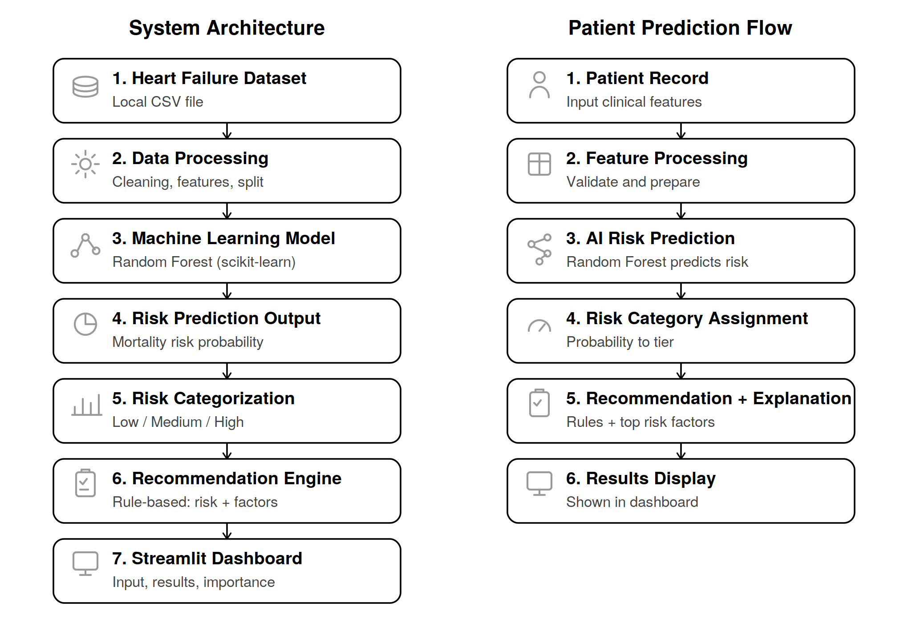
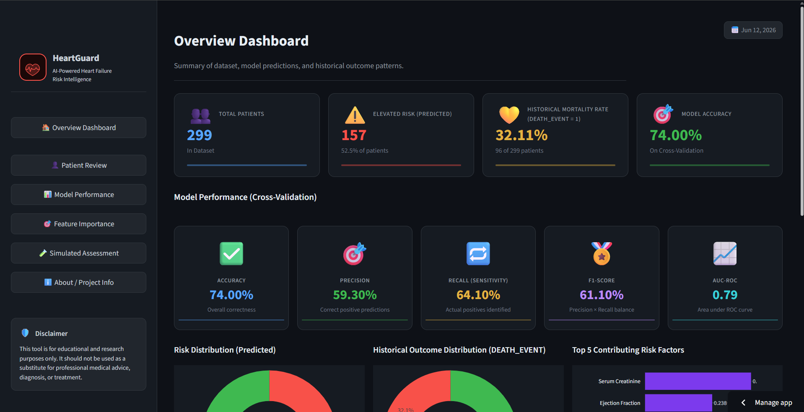
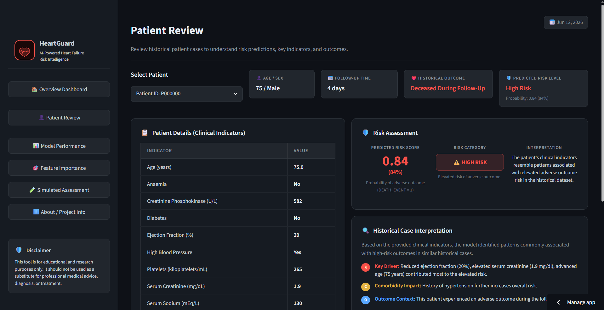
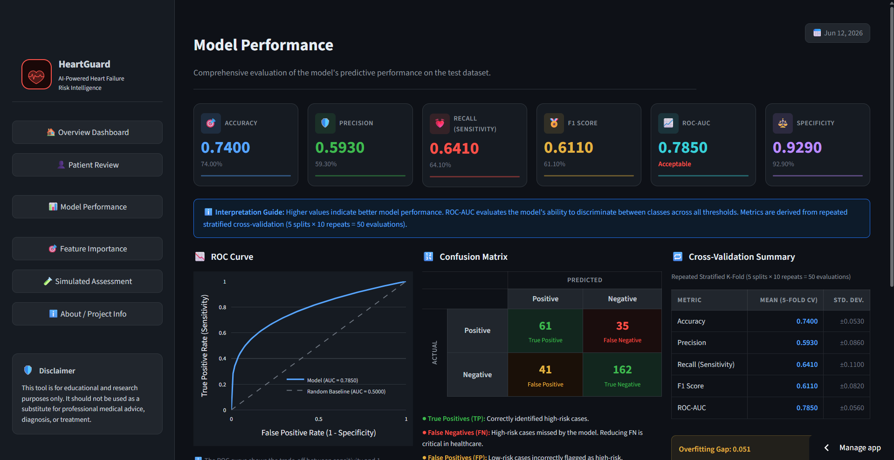
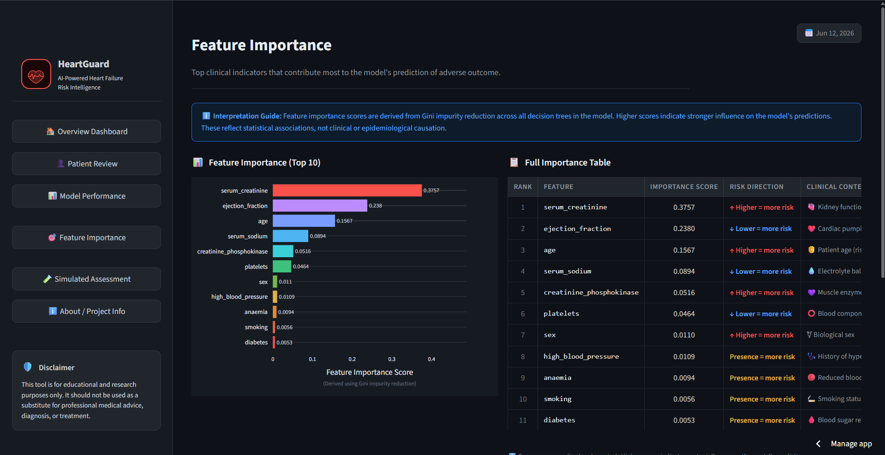
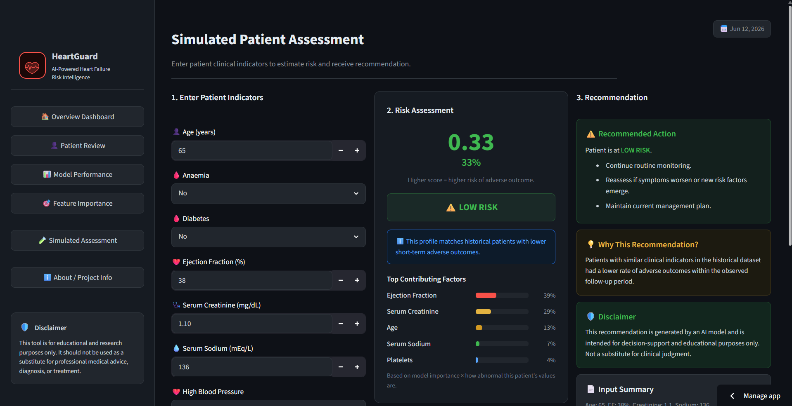
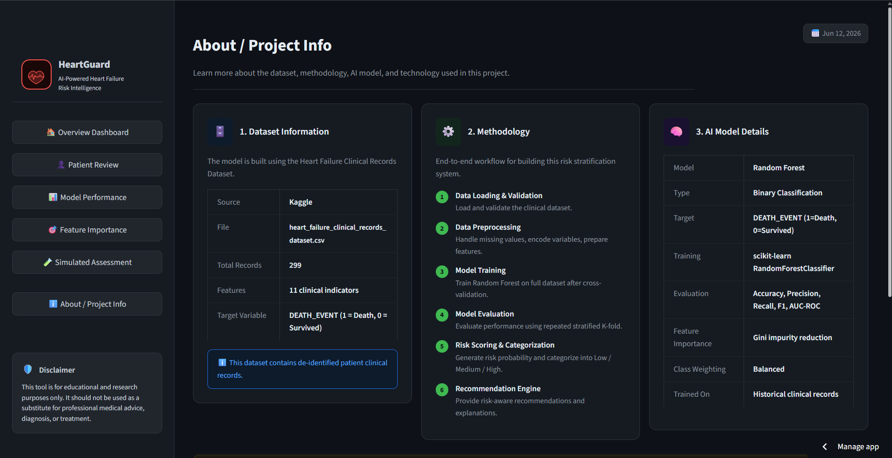

# [HeartGuard — AI-Assisted Heart Failure Risk Stratification & Recommendation System](https://clinical-workflow-ai-general-project-atllz5s7tcbgndqqmb7fwy.streamlit.app/)
Educational clinical decision-support system that uses machine learning and explainable healthcare analytics to identify patients whose clinical patterns resemble historical higher-risk heart failure cases.


## Description
HeartGuard is a machine learning-based healthcare analytics application designed to analyze historical heart failure patient data and estimate adverse outcome risk using clinical indicators such as ejection fraction, serum creatinine, sodium levels, diabetes status, and age.  
The system generates risk predictions, explainable insights, and rule-based recommendation guidance to demonstrate how AI-assisted analytics may support monitoring prioritization and clinical review workflows.


## Problem Statement
Heart failure patients may experience rapid clinical deterioration, but identifying high-risk patients early can be difficult when clinicians must manually evaluate multiple clinical indicators and historical patterns.  
Traditional assessment workflows rely heavily on physician interpretation and may not systematically leverage historical outcome data to support prioritization and monitoring decisions.


## Solution Overview
The system uses supervised machine learning to analyze patient clinical indicators and compare them against historical outcome patterns associated with elevated heart failure risk.  
Based on prediction results, the application:
- estimates adverse outcome probability
- assigns Low, Medium, or High risk categories
- generates recommendation guidance
- highlights top contributing clinical risk factors


## System Workflow / ML Pipeline
1. Load and preprocess historical heart failure dataset
2. Clean and validate clinical features
3. Train classification model using supervised learning
4. Generate risk probability predictions
5. Categorize patients into risk groups
6. Produce explainable prediction insights
7. Display results through an interactive Streamlit dashboard


## Key Features
- AI-assisted heart failure risk prediction
- Low / Medium / High patient risk categorization
- Explainable prediction insights using feature importance
- Rule-based clinical recommendation guidance
- Interactive Streamlit dashboard interface
- Historical outcome pattern analysis
- Clinical feature visualization and monitoring support


## Results / Model Performance

Metrics use repeated stratified 5-fold cross-validation (20 repeats, 100
out-of-fold estimates), not a single train/test split. 95% CIs are the
2.5/97.5 percentiles across folds.

| Metric    | Mean  | 95% CI          |
| --------- | ----- | --------------- |
| ROC-AUC   | 0.784 | [0.662, 0.894]  |
| Accuracy  | 0.740 | [0.633, 0.841]  |
| F1        | 0.610 | [0.447, 0.759]  |
| Precision | 0.592 | [0.436, 0.774]  |
| Recall    | 0.640 | [0.421, 0.842]  |

The wide intervals reflect the small cohort (299 patients, ~96 events) and
are themselves the motivation for the external validation below.

Key contributing risk factors: ejection fraction, serum creatinine,
serum sodium, and age.

## Evaluation & Validation

Two evaluation steps go beyond the standard single-split baseline. Both are
reproducible: `notebooks/evaluate_leakage.py` and
`notebooks/external_validation.py`.

### Target-leakage audit

The dataset includes `time` (follow-up duration). Including it as a feature
inflates ROC-AUC from 0.784 to 0.914 (+0.13) and F1 by +0.15. The inflation
is leakage, not signal: `time` alone accounts for ~43% of feature importance
and correlates −0.53 with the outcome, because death truncates the
observation window — and follow-up duration is undefined at real prediction
time. `time` is therefore excluded from the model.

### External validation on MIMIC-IV

The model was validated against an independent heart-failure cohort of
31,369 patients extracted from MIMIC-IV (a US ICU population), versus the
299-patient UCI cohort (Faisalabad, Pakistan). Ejection fraction and CPK
were unavailable in MIMIC, so both models use the 9 shared features.

| Experiment                        | ROC-AUC | 95% CI          |
| --------------------------------- | ------- | --------------- |
| UCI internal (9 shared features)  | 0.717   | [0.586, 0.872]  |
| Train UCI → test MIMIC (31,369)   | 0.651   | [0.641, 0.661]  |
| Train MIMIC → test UCI (299)      | 0.728   | [0.669, 0.790]  |

**Finding:** discrimination transfers across a different country and care
setting — ROC-AUC drops only 0.066 (0.717 → 0.651) on 31,369 unseen
patients. Calibration does not: F1 falls sharply because MIMIC's event rate
(9.5%) is far below UCI's (32%), so a threshold tuned on UCI over-flags on
MIMIC. In short, the model *ranks* risk well across sites but its decision
threshold needs recalibration per population.

> The MIMIC-IV cohort is credentialed data under a PhysioNet Data Use
> Agreement and is not included in this repository.


## Tech Stack
| Layer | Technologies |
| -------- | -------- |
| Programming | Python |
| Machine Learning | Scikit-learn |
| Data Processing | Pandas, NumPy |
| Visualization | Matplotlib |
| UI Framework | Streamlit |
| Model Serialization | Pickle |
| Development Tools | Jupyter Notebook, Git |


## Architecture


When a patient is scored, the flow runs: input features are received and reordered to match the model's expected feature order, passed to the trained Random Forest, which returns a mortality-risk probability. That probability is mapped to a risk tier, and the explanation and recommendation layers generate the contributing factors and rule-based guidance, all surfaced in the Streamlit dashboard.  

Risk tiers are assigned by probability: **High ≥ 0.70**, **Medium ≥ 0.40**, otherwise **Low**.

### Components
| Layer | Responsibilities | Where |
| -------- | -------- | -------- |
| Constants | Feature list, thresholds, labels, normal ranges | `presentations/utils/constants.py` |
| Prediction | Loads the model, scores a patient, assigns risk tier | `presentations/services/prediction_service.py` |
| Explanation | Computes contributing factors and risk flags from inputs | `presentations/services/explanation_service.py` |
| Recommendation | Maps risk tier to rule-based guidance | `presentations/services/recommendation_service.py` |
| Interface | Patient input, results, and feature-importance views | Streamlit app |

### Design Decisions
- **Service-layer separation** — Scoring, explanation, and recommendation logic live in separate modules rather than in the UI, because they change for different reasons and stay independently testable.
- **Model behind a thin interface** — The app calls a single scoring function and never touches scikit-learn directly, so the model can be retrained or swapped without changing application code.
- **Cached model loading** — The trained pipeline is loaded once and reused (via `lru_cache`) instead of being re-read from disk on every prediction.
- **Schema-safe inference** — Inputs are reordered to match the model's expected feature order before prediction, preventing silent feature-misalignment errors.
- **Explain, not diagnose** — The explanation layer surfaces the factors that influenced a score, with a disclaimer, and deliberately stops short of diagnostic claims — a safety boundary treated as a design constraint.

### Known Limitations & Next Steps
- **Thresholds duplicated in places.** Some clinical cutoffs appear in more than one module; I'd centralize them in `presentations/utils/constants.py` as a single source of truth.
- **Baseline model on a public dataset.** External validation on MIMIC-IV (31,369 patients) shows discrimination generalizes but the risk threshold needs per-population recalibration.


## Clinical Features / Data Dictionary
The model uses demographic, laboratory, cardiovascular, and comorbidity-related clinical indicators including:
- age
- anaemia
- diabetes
- ejection fraction
- serum creatinine
- serum sodium
- platelets
- smoking status
- high blood pressure
- follow-up duration *(present in the dataset but excluded from the model — see leakage audit)*

Detailed field definitions and application-generated outputs are documented in `docs/data-dictionary.md`.


## Demo / How To Use
1. Launch the [Streamlit application](https://clinical-workflow-ai-general-project-atllz5s7tcbgndqqmb7fwy.streamlit.app/)
2. Navigate to the Simulated Assessment page
3. Enter patient clinical indicators
4. Review generated risk probability and category
5. Analyze recommendation guidance and contributing risk factors

The application demonstrates how clinical indicators may be analyzed using machine learning-assisted healthcare analytics workflows


## Screenshots
 
 
 


## Repository Structure
```
HeartGuard/
├── data/
│   └── heart_failure_clinical_records_dataset.csv
├── docs/
│   └── data-dictionary.md
├── notebooks/
│   ├── feature_importance.csv
│   ├── metrics.csv
│   ├── pipeline.pkl
│   ├── predictions.csv
│   └── template_heart_failure.ipynb
├── presentations/
│   ├── services/
│   │   ├── __init__.py
│   │   ├── explanation_service.py
│   │   ├── prediction_service.py
│   │   └── recommendation_service.py
│   ├── utils/
│   │   ├── __init__.py
│   │   ├── constants.py
│   │   └── ui_components.py
│   ├── views/
│   │   ├── about.py
│   │   ├── feature_importance.py
│   │   ├── model_performance.py
│   │   ├── overview.py
│   │   ├── patient_review.py
│   │   └── simulated_assessment.py
│   └── app.py
├── screenshots/
│   ├── about.png
│   ├── feature_importance.png
│   ├── heartguard_architecture.png
│   ├── model_performance.png
│   ├── overview.png
│   ├── patient_review.png
│   └── simulated_assessment.png
├── .env.example
├── .gitignore
├── README.md
└── requirements.txt
```


## Setup Instructions
```
# Clone repository
git clone https://github.com/NvyGreen/HeartGuard.git

# Install dependencies
pip install -r requirements.txt

# Copy .env.example to .env and configure as needed

# Run Streamlit application
streamlit run presentations/app.py
```


## Testing

Unit tests cover risk-tier thresholds, abnormality scoring, risk flags, explanation logic, and recommendation mapping.

```bash
cd presentations
python -m pytest tests/
```


## Challenges & Lessons Learned
Key challenges encountered during development included:
- selecting clinically meaningful features
- balancing model simplicity and interpretability
- designing explainable prediction outputs
- translating prediction probabilities into understandable risk categories

The project also highlighted the importance of transparency and explainability in healthcare AI workflows.


## Disclaimer
This project is intended for educational and research demonstration purposes only.  
The generated predictions, recommendations, and explainability outputs are not intended for medical diagnosis, treatment decisions, or replacement of professional clinical judgment.
